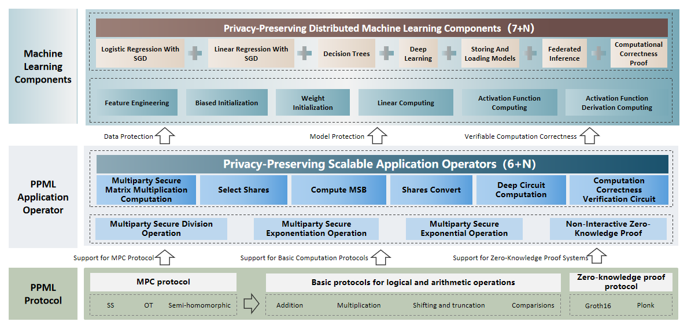
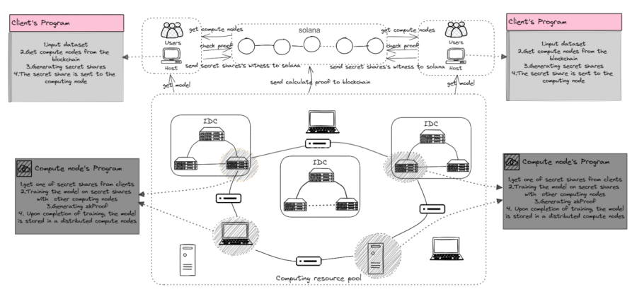
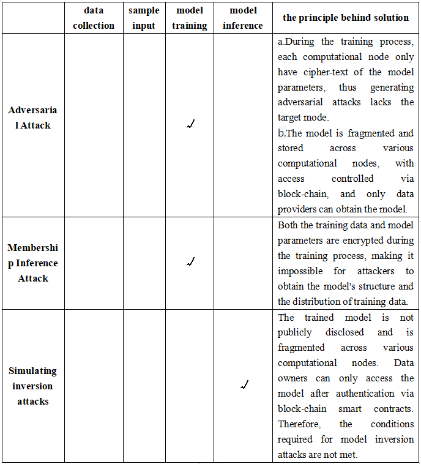
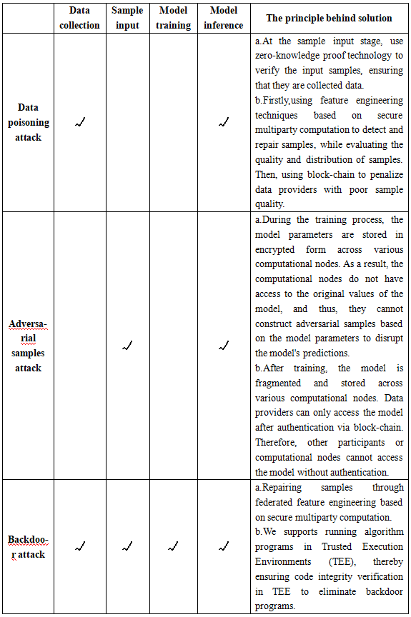

DistriAI-BSI-PPML is a machine learning framework based on privacy protection of data, algorithms, and models.

Our design aims to provide a convenient platform for data analysts, machine learning developers, and owners of computational resources to contribute their respective resources, facilitating the use of privacy-preserving techniques and artificial intelligence for data analysis, modeling, and inference while ensuring the privacy and security of training data, models, and machine learning algorithms. To achieve this goal, we offer a set of machine learning application components designed for distributed computational resource scheduling. These components encapsulate secure multi-party computation, zero-knowledge proofs, and trusted execution environments at the underlying protocol layer and operator layer abstraction, ultimately forming distributed quantum-state outsourcing computation components tailored to different machine learning algorithms.

We provide an open framework where, at the privacy protection protocol  layer  and  operator  layer, collaborate closely with experts in secure multi-party computation, zero-knowledge proofs, and trusted hardware to ensure distributed fully homomorphic computation while continuously enhancing computational performance. At the machine learning component layer, we offer flexible programming interfaces for machine learning algorithm developers, enabling them to develop their own  homomorphic modeling algorithms according to the provided interfaces.

# System Architecture

## PPML Protocol Layer

The PPML protocol layer is supported by foundational protocols for secure   multiparty   computation,  logical operations, arithmetic operations, and  zero-knowledge  proof  systems.  Specifically, in terms of foundational operations, it implements logical operations and   arithmetic   operations  such  as  secret  addition,  secret multiplication, bit  shifting,  truncation,  and secret comparison based  on  techniques like Secret Sharing (SS), Oblivious Transfer (OT), and  Semi-Homomorphic    Encryption. As   for zero-knowledge proofs, it provides Groth16 and Plonk proof systems.

## PPML Application Operator

The PPML application operator layer, supported by the foundational protocol layer, abstracts the minimal computing  units for privacy protection according to the steps of machine  learning algorithms, forming application-layer operators. Specifically,  it consists of two layers. Firstly,  based on the foundational protocol layer, it implements    secure   multiparty   division,  secure   multiparty exponentiation, and secure multiparty logarithm  operations. These foundational   operations   provide    the basic secure multiparty computation capabilities for privacy protection in the forward and backward propagation of machine learning. Additionally, it employs the Groth16 and Plonk non-interactive zero-knowledge proof systems for  achieving   non-interactive  zero-knowledge proofs. Secondly, building  upon  the  foundational  protocols  and   operations, it implements   application    operators    for    privacy-preserving computation. These   operators   allow  for flexible structuring of machine learning steps.

## Machine Learning Components Layer

The machine learning component layer implements  machine  learning algorithm  components  based  on  the interfaces  provided  by the application  operator  layer. The   system   has   developed  seven components  including  federated  modeling,   federated  inference
, model protection, and computation correctn ess  verification for developers. Developers can  customize  their own  machine learning algorithms   based  on  their  requirements  using the application operators. Specifically, it  is  divided  into two layers. Firstly, machine  learning  steps  are constructed based on the application operator  layer, such  as  feature  engineering, initialization of neural  network  weights and biases, linear computation in forward propagation,  activation   function   computation    in    forward propagation, and derivative computation of activation functions in backpropagation. Secondly, the final machine learning algorithm is customized based on these machine learning steps.

# Runtime Architecture

# The main process
## The process of data input

## The process of ciphertext computation

## The process of computational correctness verification

# Resilience to Attacks
## Defense Against Privacy Attacks

## Defense Against Security Attacks

