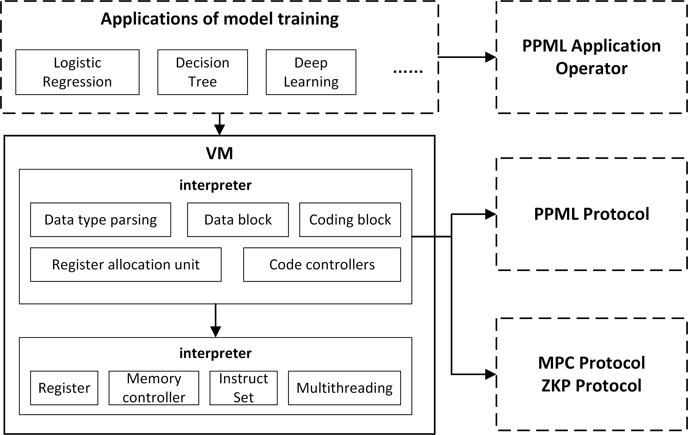

# VM runtime Architecture

In multi-party secure computing, there are quantitative and qualitative differences in the operations of addition and multiplication. Addition can be done locally, while multiplication involves communication across multiple parties. This qualitative difference will vary depending on the specific protocol, while taking advantage of the advantages of parallelized communication can reduce the impact due to network latency. The vm supports multithreading and implements parallel computing of multi-party secure computing protocol.

The vm provides an unlimited number of registers for each base data type, the numbers of which are hard-coded into bytecode. Typically, registers are used to store the input and output of instructions, and they are part of the local thread. The virtual machine's memory is used for arrays, matrices, and high-dimensional structures, and the memory array is global. And unlike general-purpose registers, the vm's integer registers support run-time value access to memory, so messages can be passed between running threads.

In terms of computing functions, vm support copying, basic computing (addition, subtraction, multiplication, division, shift and other linear operations), security instructions (such as private input, multiplication, public output, etc.), preprocessing information, advanced input and output capabilities, and integrate a variety of security protocols.

In addition, the vm supports vectorization, that is, performing the same operation on as many consecutive registers as needed. This significantly reduces overhead due to double calculations during compilation and execution. Vectorization also helps to continuously load values into registers in a structured manner.

